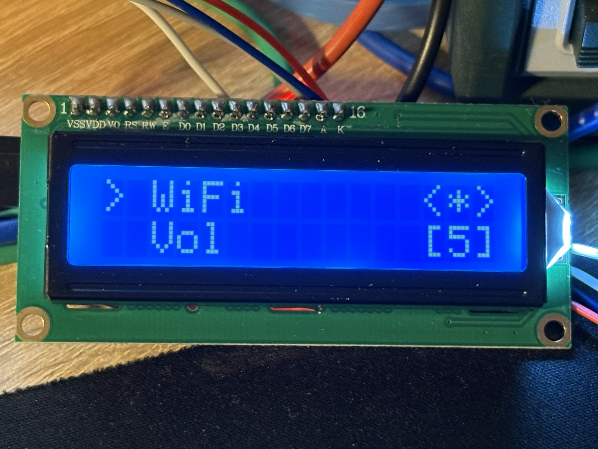
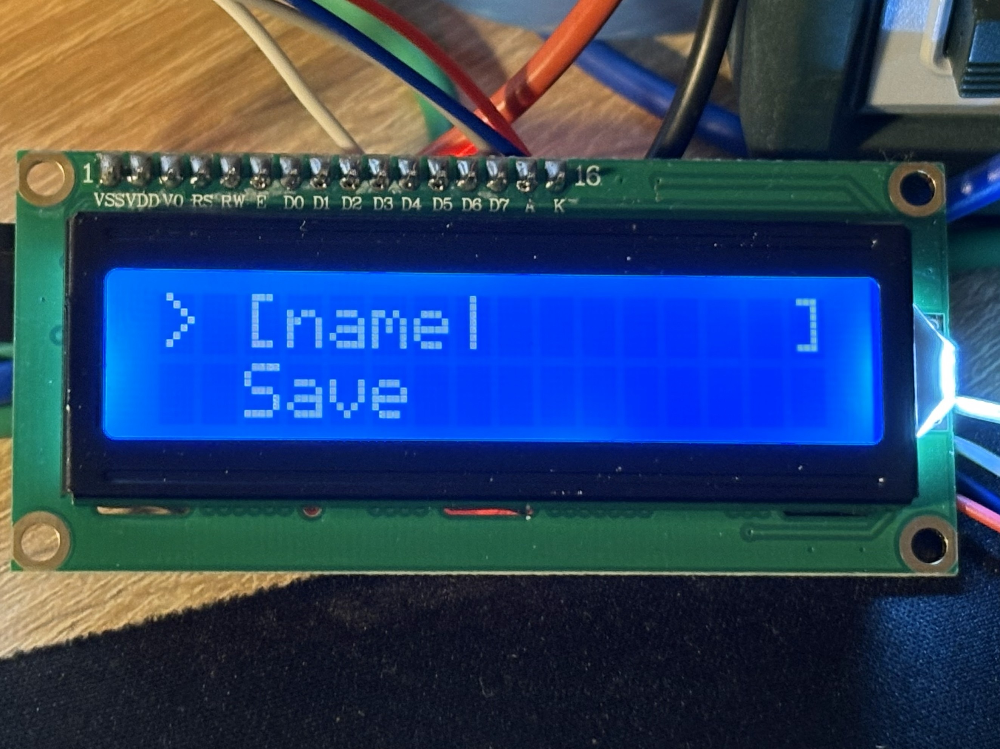
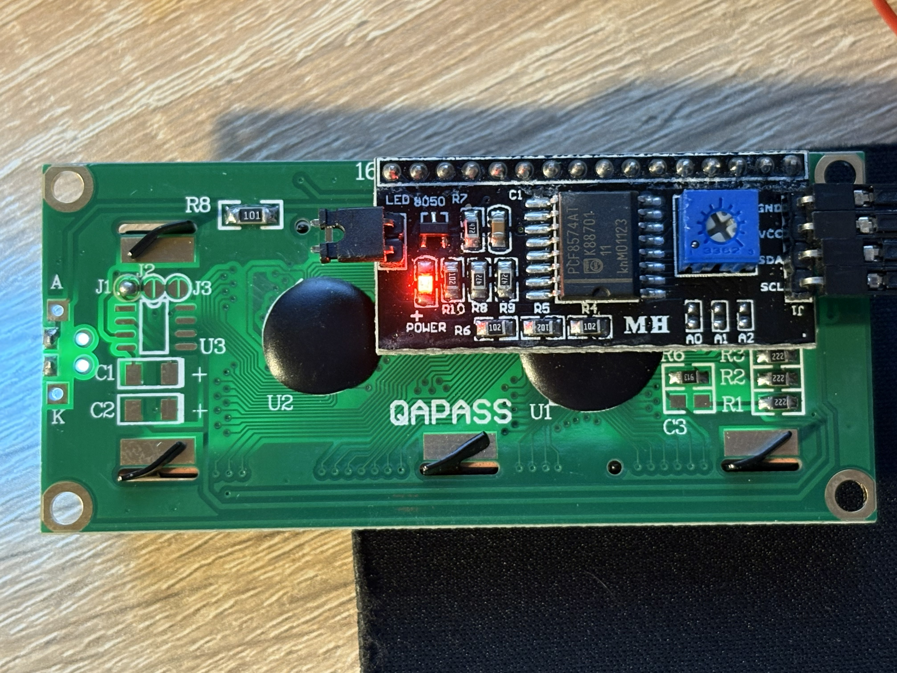

# HD44780 over I2C (PCF8574) via MCP2221A (Python)

[](https://github.com/esp-dev/hd44780-pcf8574-mcp2221a/actions/workflows/ci.yml)

A small, practical Python library for driving an HD44780-compatible character LCD through a PCF8574 I2C backpack, using an MCP2221A USB–I2C adapter.

This repo includes:

- `lcdx`: a low-level HD44780-over-PCF8574 driver (commands, data, cursor, CGRAM)
- `lcds`: a buffered “screen RAM + diff refresh” helper for efficient updates
- `menu`: a simple line-based UI framework (widgets + navigation), designed for HD44780 displays
- runnable examples and demos

## Hardware setup

This project is built around a typical, very common hardware combo:

- MCP2221A USB–I2C adapter running at **5V**
- I2C pull-ups on SDA/SCL: **5.1kΩ** to 5V
- HD44780 LCD with a permanently soldered **PCF8574AT** backpack

Wiring details: [docs/wiring.md](docs/wiring.md)

## Install

Create a virtual environment and install dependencies:

Requires Python 3.10+.

```powershell
python -m venv .venv
.\.venv\Scripts\Activate.ps1
pip install -r requirements.txt
```

Optional (recommended if you want to `import py_hd44780_i2c_pcf8574` from anywhere):

```powershell
pip install -e .
```

## Quick start

### 1) Scan I2C

```powershell
python .\examples\i2c_scan.py
```

Common addresses are `0x27` and `0x3F`. Most examples support `--scan` to pick the first responding address.

### 2) Basic “Hello” (low-level)

```powershell
python .\examples\hello_lcd.py --scan
```

This uses the low-level driver (`lcdx`) directly.

### 3) Buffered printing (`lcds`)

```powershell
python .\examples\print_lcd.py --scan "Line1\nLine2" --unescape
```

### 4) LCDS dashboard demo

```powershell
python .\examples\lcds_demo.py --scan
```

Useful options:

- `--variant A|B|C` to select the PCF8574 bit mapping (Variant A is the default)
- `--backlight on|off|toggle` to set / blink the backlight
- `--seconds N` to auto-exit

### 5) Menu demo (keyboard)

```powershell
python .\examples\menu_demo.py --scan
```

Controls (Windows console):

- `w/s/a/d` or arrow keys
- `Enter` = OK
- `Backspace` = delete/back
- `Esc` = exit

## Documentation

- Wiring and assumptions: [docs/wiring.md](docs/wiring.md)
- Low-level driver (`lcdx`): [docs/lcdx.md](docs/lcdx.md)
- Buffered refresh helper (`lcds`): [docs/lcds.md](docs/lcds.md)
- Menu system (`menu`): [docs/menu.md](docs/menu.md)

## Library overview

### `lcdx` (low-level)

Main class: `HD44780_PCF8574`

- `init()` initializes the LCD in 4-bit mode
- `set_cursor(col, row)`, `write(text)`, `write_char(byte)`
- `set_backlight(on)` (polarity controlled by `PinMapping.bl_active_high`)
- `create_char(slot, pattern)` for CGRAM custom characters

Minimal usage:

```python
from py_hd44780_i2c_pcf8574 import HD44780_PCF8574, VARIANT_A
from py_hd44780_i2c_pcf8574.lcdx import HD44780Config
from py_hd44780_i2c_pcf8574.mcp2221a_i2c import MCP2221AI2C

i2c = MCP2221AI2C(i2c_speed_hz=100_000).open()
lcd = HD44780_PCF8574(
	i2c=i2c,
	mapping=VARIANT_A,
	config=HD44780Config(address_7bit=0x3F, cols=16, rows=2),
)

lcd.init()
lcd.clear()
lcd.set_cursor(0, 0)
lcd.write("Hello!")
```

### `lcds` (buffer + diff refresh)

Main class: `LCDS`

- Keeps a full-screen in-memory buffer
- `write_at(col, row, text)` updates the buffer without touching the LCD
- `flush()` updates only the changed cells on the physical LCD
- Optional dynamic CGRAM mapping for a small set of characters

Important: `LCDS.puts()` is intentionally line-oriented with specific semantics; see [docs/lcds.md](docs/lcds.md).

### `menu` (widgets + navigation)

- A `Menu` contains `Line`s and renders them into a fixed-width display
- Supports nested submenus
- Widgets include: `SwitchItem`, `RangeItem`, `EnumItem`, `TimeItem`, `Edit`, `Ok`, `Space`, …

See [docs/menu.md](docs/menu.md) and [examples/menu_demo.py](examples/menu_demo.py).

## Examples

- [examples/hello_lcd.py](examples/hello_lcd.py): minimal low-level usage
- [examples/print_lcd.py](examples/print_lcd.py): print text using `LCDS`
- [examples/lcds_demo.py](examples/lcds_demo.py): stable buffered dashboard demo
- [examples/menu_demo.py](examples/menu_demo.py): interactive menu demo
- [examples/menu_demo_console.py](examples/menu_demo_console.py): menu demo rendered to console (optional mirroring to LCD)
- [examples/lcdx_manual_test.py](examples/lcdx_manual_test.py), [examples/lcds_manual_test.py](examples/lcds_manual_test.py): manual tests

## Photos / screenshots

Menu examples on a 16x2 LCD:



Editing a field (name edit):



PCF8574 backpack board (bottom side, soldered to the LCD):



## Notes / scope

- This project is a character LCD driver + helpers. It does **not** implement a terminal emulator.
- Text is ultimately written as bytes to the HD44780; if you need special glyphs, use CGRAM (or `LCDS` dynamic characters).

## Troubleshooting

- Nothing responds on I2C: run `python .\examples\i2c_scan.py` and confirm wiring/pull-ups.
- LCD is found, but nothing/garbage on screen: try `--variant B` / `--variant C` in the examples.
- Backlight control is inverted: flip `bl_active_high` in the selected `PinMapping` (see `py_hd44780_i2c_pcf8574/pins.py`).

## License

MIT License. See [LICENSE](LICENSE).
